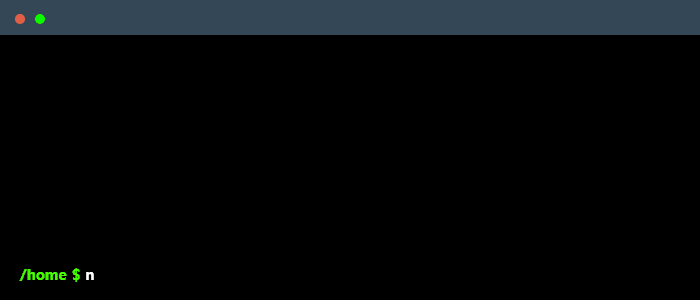

<!--
    Hey there, I'm Ayaskant Sahoo!
    Happy to see you here exploring my README code.
    Feel free to draw inspiration!
-->

    

    

    

 

### A little about me...

<h3>Student | Software Developer | Tech Enthusiast</h3>

 **• Core Team Member** @ Tech Mobius Club (The Technology Club of Indraprastha International School)
 
 **• Known Member** @ Hack Club
 
 **• Student** @ Indraprastha International School, Dwarka

---

### My Skills

**Languages, Frameworks & Web**

    

 

**Databases, Software & Tools**

    

 

### Currently Learning

    

---

### Connect with me!

    
    &nbsp;
    
    &nbsp;
    

<!--
     Oh, hello there, recruiters!
-->
---

### Employer?
> [!IMPORTANT]  
> **[Click here to download my Resume](https://example.com/your-resume-link.pdf)**

    

<!--
     Thanks for being my guest :)
-->
